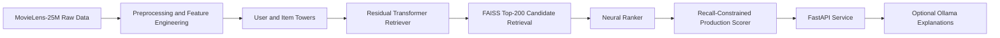

# MovieLens-25M Two-Tower Recommendation System

An industry-style recommender system that combines residual transformer retrieval, neural re-ranking, recall-constrained production scoring, FastAPI serving, Docker packaging, and optional local Ollama explanations.


## Table of Contents

- [Overview](#overview)
- [Architecture](#architecture)
- [Results](#results)
- [Prerequisites](#prerequisites)
- [Installation](#installation)
- [Dataset](#dataset)
- [Usage](#usage)
- [API Reference](#api-reference)
- [Experiment Tracking](#experiment-tracking)
- [Project Structure](#project-structure)
- [Design Decisions](#design-decisions)
- [Limitations](#limitations)
- [Acknowledgements](#acknowledgements)
- [Author](#author)
- [License](#license)

## Overview

This repository implements a full recommender engineering workflow on MovieLens-25M: offline data preparation, retrieval modeling, ranking, policy selection, serving, validation, and packaging. It is non-trivial because strong offline recommendation quality requires both architecture choices and deployment-safe decision rules, not only model training.

Popularity is a strong baseline on MovieLens. Claims are weak unless they beat popularity and protect recall behavior, so this project keeps popularity as a first-class benchmark. A two-stage architecture is realistic for production settings: retrieval scales candidate generation, and ranking improves precision on a manageable shortlist.

### Key Outcomes

- Residual transformer retriever approved as the production retrieval backbone.
- CL contrastive retriever implemented but remains experimental.
- Neural ranker improved over residual retrieval baseline.
- Recall-constrained production scorer beat popularity on NDCG@10 while improving Recall@50.
- FastAPI serving validated.
- Docker local serving validated.
- Ollama explanations validated as optional post-processing.

Approved headline numbers:

- Validation: popularity NDCG@10 `0.2663` -> selected scorer NDCG@10 `0.3115`
- Validation: popularity Recall@50 `0.7114` -> selected scorer Recall@50 `0.7297`
- Test: popularity NDCG@10 `0.2625` -> selected scorer NDCG@10 `0.3176`
- Test: popularity Recall@50 `0.6795` -> selected scorer Recall@50 `0.7124`
- Serving: API validation `18/18`, p50 `29.70 ms`, p95 `35.05 ms`, max `36.64 ms`
- Docker smoke test `6/6`, Ollama validation `9/9`, explanations generated `3`, explanation latency about `70 to 73 seconds`

## Architecture



| Component | Purpose | Technology | Output Artifact |
|---|---|---|---|
| Data pipeline | Build leakage-safe train/val/test data and features | Polars, PyArrow, Python scripts | `data/processed/*.parquet`, `dataset_stats.json` |
| Residual transformer retriever | Generate user/item embeddings and retrieval scores | PyTorch | `artifacts/models/best_residual_transformer_retriever.pt` |
| FAISS index | Fast inner-product candidate lookup | FAISS | `artifacts/faiss/index.faiss` + metadata/mapping |
| Neural ranker | Re-rank top-200 candidates | PyTorch MLP ranker | `artifacts/models/best_neural_ranker.pt` |
| Production scorer | Select serving policy under recall guard | Weighted scoring policy search | `artifacts/reports/production_scorer_selection.json` |
| FastAPI serving | Online inference endpoints | FastAPI, Uvicorn, Pydantic | Live API + `artifacts/reports/serving_api_validation.json` |
| Docker local packaging | Reproducible local service packaging | Docker, docker-compose | `artifacts/reports/docker_smoke_test.json` |
| Ollama explanation layer | Optional post-hoc item explanations | Ollama local models + HTTP integration | `artifacts/reports/ollama_explanation_validation.json` |
| MLflow tracking | Run metadata and artifact tracking | MLflow + SQLite backend | `mlflow.db`, `mlruns/` |

## Results

### A) Model Progression and Promotion Decisions

| Stage | Purpose | Outcome | Promotion Decision |
|---|---|---|---|
| Popularity baseline | Strong non-neural benchmark | Remained highly competitive | Kept as mandatory baseline and fallback component |
| Plain two-tower retriever | Initial neural retrieval baseline | Established retrieval baseline quality | Approved as intermediate baseline |
| Residual transformer retriever | Improve retrieval while preserving baseline signal | Outperformed plain two-tower in approved flow | Promoted as production retrieval backbone |
| CL contrastive retriever | Add auxiliary contrastive objectives | Implemented and validated structurally, sample acceptance failed | Kept experimental, not promoted |
| Neural ranker | Improve ranking over residual retrieval candidates | Improved strongly vs residual retrieval-only metrics | Promoted into production scoring path |
| Recall-constrained production scorer | Beat popularity without recall collapse | Beat popularity on NDCG@10 and improved Recall@50 | Final approved serving scorer |

### B) Final Full-Data Metrics

| Model / Scorer | Split | HR@10 | MRR@10 | NDCG@10 | Recall@50 |
|---|---|---:|---:|---:|---:|
| Popularity baseline | Validation | 0.3854 | 0.2301 | 0.2663 | 0.7114 |
| Popularity baseline | Test | 0.3736 | 0.2286 | 0.2625 | 0.6795 |
| Residual retriever | Validation | — | — | 0.0450 | 0.2485 |
| Residual retriever | Test | — | — | 0.0325 | 0.2062 |
| Neural ranker | Validation | — | — | 0.1812 | 0.5326 |
| Neural ranker | Test | — | — | 0.1871 | 0.5756 |
| Selected scorer | Validation | 0.4354 | 0.2732 | 0.3115 | 0.7297 |
| Selected scorer | Test | 0.4477 | 0.2774 | 0.3176 | 0.7124 |

HR@10 and MRR@10 were not included in the final consolidated report for some intermediate artifacts; NDCG@10 and Recall@50 are shown where available.

Selected production scorer policy:

- `ranker_topk_popularity_backfill`
- `alpha=1.0`, `beta=0.1`, `gamma=0.0`, `top_k_focus=20`

### C) Serving Benchmarks

| Validation Area | Result |
|---|---|
| Local API contract validation | `18/18` passed |
| Docker smoke test | `6/6` passed |
| Serving latency p50 | `29.70 ms` |
| Serving latency p95 | `35.05 ms` |
| Serving latency max | `36.64 ms` |
| Ollama explanation validation | `9/9` passed |
| Ollama explanation latency | about `70 to 73 seconds` |

Note: explanation generation is optional and intentionally post-processing; it does not change ranking order.

## Prerequisites

| Tool | Version | Notes |
|---|---|---|
| Python | 3.12 | Pinned and managed through uv |
| uv | Latest | Recommended environment and dependency manager |
| CUDA Toolkit | 12.8 | Optional; useful for GPU training |
| Ollama | Latest | Required only for local explanation generation |
| Docker Desktop | Latest | Optional; used for containerized local serving |
| Git | 2.x | Required for cloning and version control |

- Windows 11 PowerShell tested.
- Linux/macOS likely compatible, but commands may need path adjustments.
- CPU is sufficient for API serving if trained artifacts already exist.
- GPU is recommended for training.
- CUDA is not required for serving precomputed artifacts.

Required local Ollama models:

- `qwen3:4b`
- `qwen3-embedding:0.6b`

```bash
ollama pull qwen3:4b
ollama pull qwen3-embedding:0.6b
```

## Installation

```bash
git clone https://github.com/sundar139/Two-Tower-Recommendation-System.git
cd Two-Tower-Recommendation-System
```

Windows PowerShell:

```powershell
Copy-Item env.example .env -Force
uv sync --extra dev
uv run python verify.py
uv run ruff check .
uv run mypy src
uv run pytest -q
```

Linux/macOS equivalent env copy:

```bash
cp env.example .env
uv sync --extra dev
uv run python verify.py
uv run ruff check .
uv run mypy src
uv run pytest -q
```

## Dataset

Dataset: GroupLens MovieLens 25M

- URL: https://grouplens.org/datasets/movielens/25m/
- Broad contents: ratings, movies metadata, tags, links, genome scores/tags
- Raw dataset is not committed to this repository
- Download directly from GroupLens and follow their licensing/usage terms
- Place raw files under `data/raw/`
- Generated processed data is ignored by Git

Expected raw layout:

```text
data/raw/ml-25m/
  ratings.csv
  movies.csv
  tags.csv
  links.csv
  genome-scores.csv
  genome-tags.csv
```

## Usage

### A) Verify Environment

```powershell
Copy-Item env.example .env -Force
uv run python verify.py
```

### B) Run Data Pipeline

```powershell
uv run python scripts/download_movielens.py --config configs/data.yaml
uv run python scripts/prepare_data.py --config configs/data.yaml --force
```

### C) Train and Evaluate Retrieval

```powershell
uv run python scripts/train_retriever.py --config configs/retrieval.yaml --model-type baseline
uv run python scripts/evaluate_retriever.py --config configs/retrieval.yaml --model baseline --split val

uv run python scripts/train_retriever.py --config configs/transformer_retrieval_residual.yaml --model-type residual_transformer --init-from-baseline artifacts/models/best_baseline_retriever.pt
uv run python scripts/evaluate_retriever.py --config configs/transformer_retrieval_residual.yaml --model residual_transformer --split val
uv run python scripts/evaluate_retriever.py --config configs/transformer_retrieval_residual.yaml --model residual_transformer --split test

uv run python scripts/export_faiss_index.py --config configs/transformer_retrieval_residual.yaml --model-type residual_transformer
```

### D) Train and Evaluate Ranker

```powershell
uv run python scripts/generate_ranker_candidates.py
uv run python scripts/train_ranker.py
uv run python scripts/evaluate_ranker.py --split val
uv run python scripts/evaluate_ranker.py --split test
uv run python scripts/select_production_scorer.py --config configs/ranker.yaml
uv run python scripts/check_production_scorer_acceptance.py --selection artifacts/reports/production_scorer_selection.json
```

### E) Run Local API

The API requires approved local artifacts: processed data, FAISS index, residual retriever checkpoint, neural ranker checkpoint, and serving configuration. Before serving, run:

```powershell
uv run python scripts/check_docker_artifacts.py --config configs/serving.yaml
```

This verifies that required artifact paths exist.

```powershell
uv run python scripts/run_api.py --config configs/serving.yaml --host 127.0.0.1 --port 8000
```

### F) Validate API

```powershell
uv run python scripts/validate_serving_api.py --base-url http://127.0.0.1:8000 --timeout-seconds 120 --max-explanation-items 3
```

### G) Run Docker

```powershell
uv run python scripts/check_docker_artifacts.py --config configs/serving.yaml
docker compose build
docker compose up recommender-api
uv run python scripts/docker_smoke_test.py
```

### H) Run Ollama Explanations

```powershell
ollama serve
ollama pull qwen3:4b
ollama pull qwen3-embedding:0.6b
uv run python scripts/validate_ollama_explanations.py --base-url http://127.0.0.1:8000 --ollama-url http://127.0.0.1:11434 --timeout-seconds 180 --max-explanation-items 3
```

## API Reference

| Endpoint | Method | Purpose |
|---|---|---|
| `/` | GET | Service identity and links |
| `/health` | GET | Liveness probe |
| `/healthz` | GET | Liveness alias |
| `/ready` | GET | Readiness probe |
| `/readyz` | GET | Readiness alias |
| `/metadata` | GET | Runtime metadata and scorer policy |
| `/recommendations` | POST | Primary recommendation endpoint |
| `/v1/recommend` | POST | Backward-compatible recommendation endpoint |
| `/recommendations/{user_id}` | GET | Convenience recommendation endpoint |
| `/users/{user_id}/history` | GET | Recent user history |
| `/v1/explain` | POST | Explanation endpoint |
| `/explanations/recommendations` | POST | Backward-compatible explanation endpoint |

Health:

```bash
curl http://127.0.0.1:8000/health
```

Metadata:

```bash
curl http://127.0.0.1:8000/metadata
```

Recommendations:

```bash
curl -X POST http://127.0.0.1:8000/recommendations \
  -H "Content-Type: application/json" \
  -d "{\"user_idx\":0,\"k\":10,\"exclude_seen\":true,\"include_debug\":false,\"allow_cold_start\":true}"
```

Abbreviated example response:

```json
{
  "user_idx": 0,
  "recommendations": [
    {
      "movieId": 4993,
      "title": "Lord of the Rings: The Fellowship of the Ring, The (2001)",
      "final_score": 0.9821
    },
    {
      "movieId": 7153,
      "title": "Lord of the Rings: The Return of the King, The (2003)",
      "final_score": 0.9764
    }
  ],
  "scorer_policy": "ranker_topk_popularity_backfill"
}
```

This is an abbreviated example for readability; actual recommendations vary by user and runtime artifacts.

Recommendations with explanations:

```bash
curl -X POST http://127.0.0.1:8000/recommendations \
  -H "Content-Type: application/json" \
  -d "{\"user_idx\":0,\"k\":5,\"exclude_seen\":true,\"include_explanations\":true,\"max_explanation_items\":3}"
```

Cold start:

```bash
curl -X POST http://127.0.0.1:8000/recommendations \
  -H "Content-Type: application/json" \
  -d "{\"user_idx\":999999999,\"k\":10,\"allow_cold_start\":true}"
```

Behavior notes:

- Explanations are post-processing only and do not change ranking order.
- Cold-start requests use popularity fallback when allowed.
- Invalid `k` returns structured validation errors.

## Experiment Tracking

MLflow is configured with a local SQLite backend and local artifact store:

- Metadata backend: `sqlite:///mlflow.db`
- Artifact directory: `mlruns/`

Start MLflow UI:

```powershell
uv run python scripts/start_mlflow_ui.py --run
```

Typical tracked outputs include:

- Hyperparameters and config values
- Training and validation losses
- NDCG@10, MRR@10, HR@10, Recall@50
- Selection and acceptance artifacts under `artifacts/reports/`

## Project Structure

```text
configs/                        # retrieval, ranker, serving, and data configs
scripts/                        # reproducible CLI workflows for train/eval/serve/validate
src/movie_recsys/               # core package
src/movie_recsys/modeling/      # retrieval models and training utilities
src/movie_recsys/ranking/       # ranker features, model, evaluation, acceptance
src/movie_recsys/serving/       # FastAPI app, schemas, artifact registry, explainers
tests/                          # unit and integration tests
data/                           # raw/interim/processed (only .gitkeep tracked)
artifacts/                      # generated models/indexes/reports (ignored)
mlruns/                         # MLflow artifacts (ignored)
```

## Design Decisions

### A) Why Two-Stage Retrieval and Ranking?

Retrieval is optimized for scalable candidate generation, while ranking is optimized for precision on a small candidate pool. This split reflects common production recommender system design.

### B) Why Residual Transformer Retriever?

Pure transformer retrieval underperformed during development. The residual/gated approach preserved baseline retrieval signal and added sequence modeling safely, leading to promotion of residual transformer as the production retrieval backbone.

### C) Why CL Stayed Experimental?

The CL retriever path was implemented and tested, but sample acceptance failed. It was intentionally not promoted because production quality criteria took precedence over architectural novelty.

### D) Why Compare Against Popularity?

Popularity is a strong MovieLens baseline. Recommender improvements are not credible unless they are compared against it and evaluated under stable guardrails.

### E) Why Recall-Constrained Production Scorer?

An earlier hybrid scorer improved NDCG but dropped Recall@50 too much. The final top-k ranker plus popularity backfill policy improved NDCG while preserving and improving Recall@50.

### F) Why FastAPI and Docker?

FastAPI provides a clear serving contract and easy validation. Docker local packaging makes serving reproducible and separates training artifacts from runtime API infrastructure.

### G) Why Ollama Explanations Are Optional?

Explanations are post-processing metadata. They do not affect ranking order, and fail-open behavior keeps recommendation availability when LLM calls are unavailable.

### H) Why Artifacts Are Mounted in Docker?

Model checkpoints and index artifacts are large and evolve independently from API code. Mounting keeps images smaller and supports reproducible local validation with approved artifacts.

## Limitations

- No online feedback loop: the model is trained offline on historical ratings and does not update from live user interactions. A production system would require periodic retraining or online learning.
- Offline evaluation only: MovieLens metrics are useful for benchmarking, but they do not prove real-world user satisfaction or business impact.
- No authentication or user management: the FastAPI service is designed for local demonstration and does not include production-grade access control.
- No cloud deployment yet: Docker packaging is local-first; cloud deployment would require secrets management, artifact storage, monitoring, and infrastructure configuration.
- No frontend UI: the project exposes API endpoints and validation scripts, but no web interface is included.
- Ollama explanations can be slow: local LLM explanations are optional post-processing and do not affect recommendation ranking.
- CL retriever remains experimental: the contrastive model was implemented and tested, but it was not promoted because it did not satisfy acceptance criteria.
- Artifacts are required locally: serving depends on processed data, FAISS index files, and trained checkpoints that are intentionally not tracked in Git.
- Popularity remains important: the final scorer intentionally uses popularity backfill because popularity is a strong baseline on MovieLens-25M.

## Acknowledgements

- GroupLens MovieLens 25M dataset
- PyTorch
- FAISS
- FastAPI
- MLflow
- Ollama
- Docker
- uv

F. Maxwell Harper and Joseph A. Konstan. The MovieLens Datasets: History and Context. ACM Transactions on Interactive Intelligent Systems, 5(4):19:1-19:19, December 2015.

Contrastive-learning note:

The contrastive retriever work was inspired by CL-EPIDTN-style contrastive recommendation ideas, but this repository does not claim a full paper reproduction.

## Author

**Rohith Sundar Jonnalagadda**  
[LinkedIn](https://www.linkedin.com/in/rohithsundarj/) · [GitHub](https://github.com/sundar139) · MS Computer Science, Kennesaw State University

## License

This project is licensed under the MIT License. See the [LICENSE](./LICENSE) file for details.