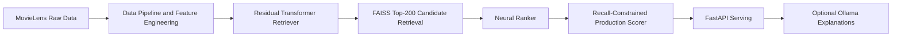

# MovieLens-25M Two-Tower Recommender System


## Executive Summary

This repository implements a production-oriented MovieLens-25M recommendation stack with a two-stage architecture: residual transformer retrieval for candidate generation, neural ranking for reordering, and a recall-constrained production scorer that improves ranking quality over popularity while preserving Recall@50 safety. The system is shipped with a local FastAPI service, Docker local packaging, and optional local Ollama explanations that are intentionally fail-open and do not affect recommendation order.

## Why This Project Matters

- Real recommender systems commonly split into retrieval (fast candidate generation) and ranking (precision-focused reordering).
- Popularity is a strong baseline that many experimental models fail to beat in reliable production settings.
- This project does not optimize only for NDCG; it compares against popularity and explicitly enforces a Recall@50 guard before promotion.

## Architecture Overview



## Final Results (Full Data)

All rows below are offline full-data evaluations with split context included.

| Stage | Split | HR@10 | MRR@10 | NDCG@10 | Recall@50 |
|---|---|---:|---:|---:|---:|
| Popularity baseline | Validation | 0.385364 | 0.230085 | 0.266328 | 0.711440 |
| Popularity baseline | Test | 0.373635 | 0.228624 | 0.262527 | 0.679510 |
| Residual retriever (retrieval-only) | Validation | 0.090569 | 0.031410 | 0.045040 | 0.248491 |
| Residual retriever (retrieval-only) | Test | 0.067519 | 0.022010 | 0.032480 | 0.206234 |
| Neural ranker (ranker-only) | Validation | 0.281478 | 0.150470 | 0.181151 | 0.532570 |
| Neural ranker (ranker-only) | Test | 0.294949 | 0.154198 | 0.187112 | 0.575556 |
| Selected production scorer | Validation | 0.435364 | 0.273246 | 0.311523 | 0.729658 |
| Selected production scorer | Test | 0.447748 | 0.277436 | 0.317591 | 0.712374 |

## Approved Production Scorer

- policy: `ranker_topk_popularity_backfill`
- alpha: `1.0`
- beta: `0.1`
- gamma: `0.0`
- top_k_focus: `20`

Why this was selected:

- It beats popularity on NDCG@10 (validation and test).
- It preserves and improves Recall@50 against popularity under the acceptance guard.

## Serving Results

- Core API validation: `18/18` checks passed.
- Local serving benchmark (`50` requests):
  - p50 latency: `29.70 ms`
  - p95 latency: `35.05 ms`
  - max latency: `36.64 ms`
- Docker local smoke test: `6/6` checks passed.
- Ollama explanation validation: `9/9` checks passed.
- Explanation generation is intentionally optional and slower because local LLM generation is post-processing.

## Quickstart

### 1) Setup

```powershell
Copy-Item env.example .env -Force
uv sync --extra dev
```

### 2) Verify

```powershell
uv run python verify.py
uv run ruff check .
uv run mypy src
uv run pytest -q
```

### 3) Start MLflow (SQLite backend)

```powershell
uv run python scripts/start_mlflow_ui.py --run
```

### 4) Run API Locally

```powershell
uv run python scripts/run_api.py --config configs/serving.yaml --host 127.0.0.1 --port 8000
```

### 5) Validate Serving

```powershell
uv run python scripts/validate_serving_api.py --base-url http://127.0.0.1:8000 --timeout-seconds 120 --max-explanation-items 3
```

### 6) Run Docker (Local)

```powershell
uv run python scripts/check_docker_artifacts.py --config configs/serving.yaml
docker compose build
docker compose up recommender-api
```

### 7) Run Ollama Explanation Validation

```powershell
uv run python scripts/validate_ollama_explanations.py --base-url http://127.0.0.1:8000 --ollama-url http://127.0.0.1:11434 --timeout-seconds 180 --max-explanation-items 3
```

## Repository Structure

```text
configs/                 # training, ranking, and serving configs
data/                    # raw/interim/processed data (gitkeeps tracked)
docs/                    # architecture, evidence, workflow docs
scripts/                 # reproducible pipeline, training, eval, serving scripts
src/                     # core recommender and serving implementation
tests/                   # unit and integration tests
artifacts/               # generated model/index/report outputs (git-ignored)
mlruns/                  # MLflow artifacts (git-ignored)
```

## Reproducibility

- `env.example` provides reproducible local configuration defaults.
- `uv` is used for deterministic dependency and command execution.
- MLflow tracking uses SQLite metadata (`mlflow.db`) and local artifact storage (`mlruns/`).
- Docker service mounts local artifacts/configs for reproducible local serving with approved checkpoints.
- Generated artifacts and caches are excluded from Git; only data directory `.gitkeep` sentinels are tracked.

## Limitations

- CL retriever remains experimental and is not promoted to production.
- Ollama explanations are optional and can be slow due to local model generation latency.
- Docker image currently mounts local artifacts rather than baking model binaries.
- No cloud deployment, authentication, or frontend layer is implemented yet.
- Offline MovieLens quality does not guarantee online user satisfaction in production environments.

## Project Status

- Retrieval: approved
- Ranking: approved
- Serving: approved
- Docker local packaging: approved
- Ollama explanation endpoint: approved
- Final portfolio polish: in progress