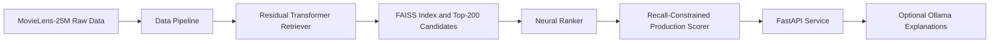
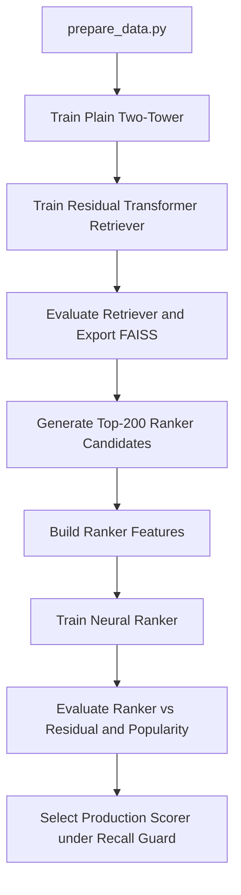
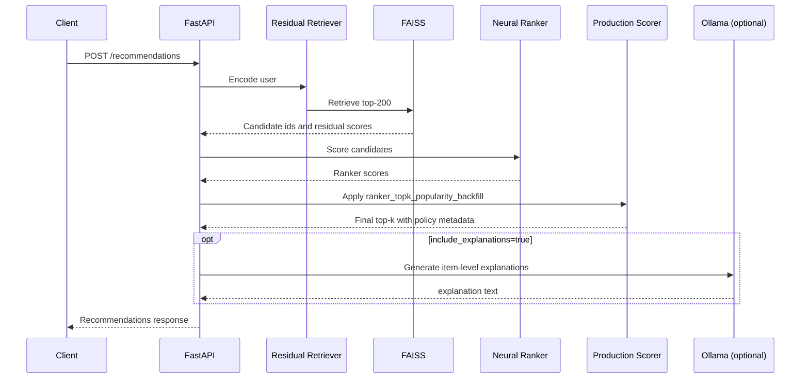
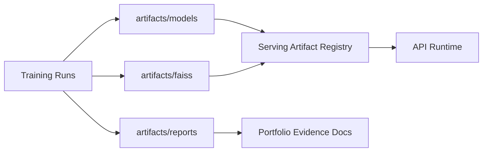

# System Architecture

## End-to-End Overview

The approved production path is residual retrieval plus neural ranking plus recall-constrained scorer selection.
The CL retriever branch remains experimental and is not in the production serving path.

## Training Architecture

Key training outputs:

- Retriever checkpoint: `artifacts/models/best_residual_transformer_retriever.pt`
- FAISS bundle: `artifacts/faiss/index.faiss`, metadata, mapping parquet
- Ranker checkpoint: `artifacts/models/best_neural_ranker.pt`
- Scorer selection report: `artifacts/reports/production_scorer_selection.json`

## Serving Architecture

## Artifact Flow

## Production Scorer Logic

Selected policy:

- `ranker_topk_popularity_backfill`
- `alpha=1.0`
- `beta=0.1`
- `gamma=0.0`
- `top_k_focus=20`

Decision rule:

1. Compute hybrid score for primary ranking window with ranker and popularity weights.
2. Use popularity backfill beyond the focus window to protect recall behavior.
3. Select using validation NDCG@10 only, while enforcing `Recall@50 >= 0.95 * popularity Recall@50`.

## Explanation Layer Logic

Explanations are post-processing metadata only:

- Retrieval, ranking, and scorer ordering are completed first.
- Explanation generation can be requested per call.
- If Ollama is unavailable and fail-open is enabled, recommendations are still returned with `explanation_status=unavailable`.
- Explanations do not mutate scores or reorder the ranked list.

## Mermaid Validation Note

The Mermaid blocks in this document use standard GitHub Markdown-supported syntax (`flowchart`, `sequenceDiagram`) and are intended to render directly in repository viewers that support Mermaid.
